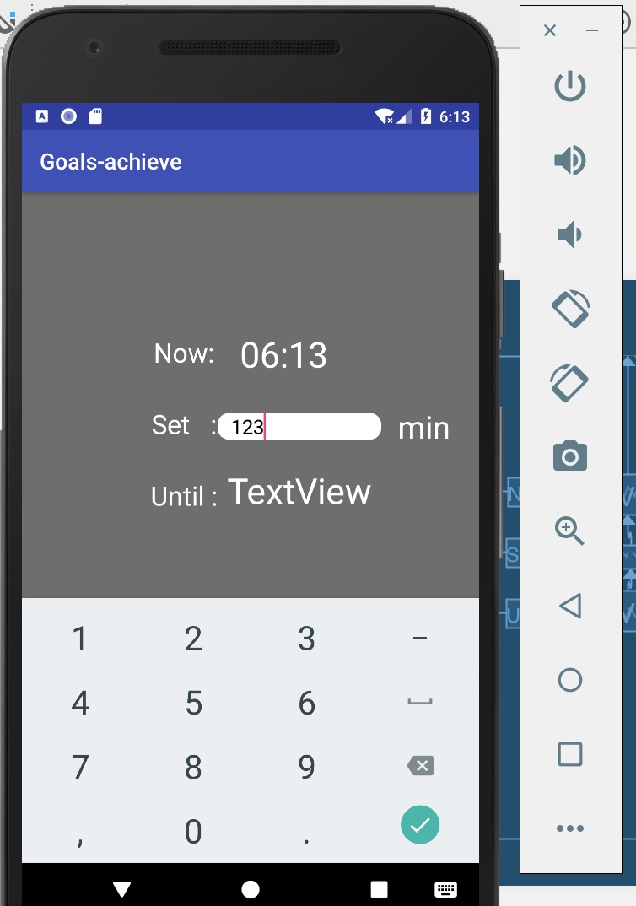

# Goalsachieve

Please note that this item has been cancelled, new project url is 
===
**https://github.com/RicardoX3/lock_2**
---
This item has some bug that I can't reslove but the code is right.Because of that, I create a new project to replace this one.
---

Mobile app assignment
It's the prototype, it can show the current time.
And you can set the timer( the function is not complete enough in this version)

